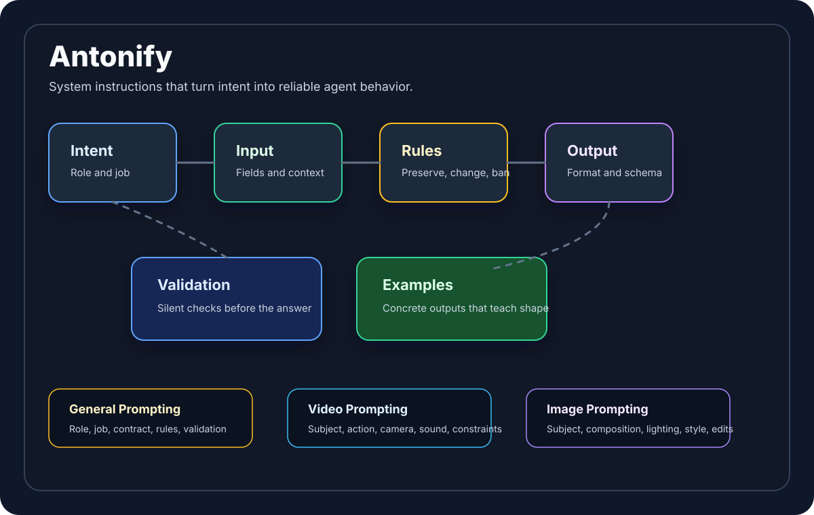

# Antonify

Antonify is a practical kit for creating strong system instructions for AI agents.

The goal is simple: turn messy intent into instructions that give an AI model clear direction, reliable output shape, and enough judgment to do the job without drifting.

## What Antonify Helps You Build

- System instructions for JSON-output agents
- Workflow agents with role-specific behavior
- Video-generation prompt agents
- Short-form ad blueprint agents
- Variation agents for Hooks, Problems, Demos, Proof, Social Proof, Transformations, Objections, and CTAs
- Validation checklists for testing whether an instruction actually works

## Core Idea

Good system instructions are not long because they are fancy. They are complete because they answer the questions a model otherwise has to guess:

- What is my job?
- What input do I receive?
- What output must I produce?
- What should I preserve?
- What may I change?
- What must I never invent?
- What does a good result look like?
- How do I silently validate before answering?

## Repository Map

- [docs/principles.md](docs/principles.md): the Antonify instruction-writing principles
- [docs/workflow.md](docs/workflow.md): step-by-step workflow for creating or improving instructions
- [docs/general-prompting.md](docs/general-prompting.md): provider-neutral prompting method
- [docs/video-prompting.md](docs/video-prompting.md): direct video-generation prompt guide
- [docs/image-prompting.md](docs/image-prompting.md): direct image-generation and image-editing prompt guide
- [docs/seedance-video-prompting.md](docs/seedance-video-prompting.md): Seedance-style video prompt logic
- [docs/validation.md](docs/validation.md): how to test instructions before shipping them
- [templates/system-instruction-template.md](templates/system-instruction-template.md): general-purpose system instruction template
- [templates/json-output-agent-template.md](templates/json-output-agent-template.md): strict JSON agent template
- [templates/general-prompt-system-instruction.md](templates/general-prompt-system-instruction.md): generalized prompt architect instruction
- [templates/video-prompt-system-instruction.md](templates/video-prompt-system-instruction.md): video prompt system instruction
- [templates/image-prompt-system-instruction.md](templates/image-prompt-system-instruction.md): image prompt system instruction
- [templates/video-node-agent-template.md](templates/video-node-agent-template.md): video prompt/node agent template
- [templates/variation-agent-template.md](templates/variation-agent-template.md): role-based variation agent template
- [checklists/instruction-quality-checklist.md](checklists/instruction-quality-checklist.md): practical review checklist
- [examples/ad-blueprint-agent.md](examples/ad-blueprint-agent.md): compact ad blueprint agent example
- [examples/variation-agent-hook.md](examples/variation-agent-hook.md): Hook variation agent example

## Quick Start

1. Define the agent's job in one sentence.
2. Write the exact input contract.
3. Write the exact output contract.
4. Add preservation rules.
5. Add transformation rules.
6. Add anti-invention rules.
7. Add role-specific quality rules.
8. Add a silent validation checklist.
9. Add one valid example output.
10. Test with 5 to 10 realistic inputs.

## The Antonify Rule

If the model can fail by guessing, the instruction should remove the guess.

If the instruction repeats itself, merge the duplicate rule.

If the instruction says "make it good", replace that with visible, testable criteria.

If the output shape matters, include a valid example.

## Publishing

This repo is designed to be published as `antonify`.

If GitHub CLI is installed and authenticated:

```bash
gh repo create antonify --private --source . --remote origin --push
```

Or create an empty GitHub repo named `antonify`, then run:

```bash
git remote add origin https://github.com/<your-username>/antonify.git
git push -u origin main
```

## Professional Direction

Antonify is built around one practical belief: a system instruction should behave like an operating brief for a skilled agent. It should define the job, the input, the rules, the output, and the validation path clearly enough that the model does not have to guess what "good" means.



Use Antonify when you want instructions that are:

- clear enough for a model to follow consistently
- strict enough for structured output
- flexible enough for creative work
- grounded enough to avoid invented claims
- testable enough to improve over time

The same architecture works for general agents, JSON agents, image prompt agents, video prompt agents, and role-specific variation agents.
