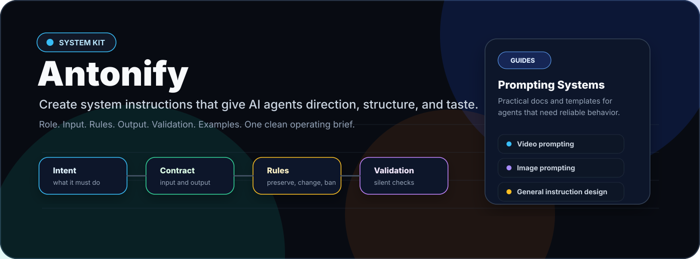
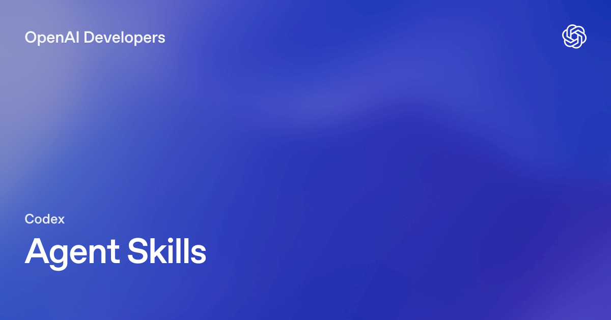
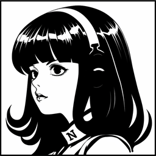

# Antonify

Antonify is a practical kit for creating, improving, and generalizing system instructions for any kind of AI agent.

The goal is simple: turn messy intent into instructions that give an AI model clear direction, reliable output shape, and enough judgment to do the job without drifting.

Video and image prompt guides are included as specialized extras, but the core of Antonify is generalized instruction design.

## What Antonify Helps You Build

- General instruction editors and prompt architects
- System instructions for any type of AI agent
- JSON-output agents
- Workflow agents with role-specific behavior
- Validation checklists for testing whether an instruction actually works
- Extra video-generation prompt agents
- Extra image-generation and image-editing prompt agents

## Core Idea

Good system instructions are not long because they are fancy. They are complete because they answer the questions a model otherwise has to guess:

- What is my job?
- What input do I receive?
- What output must I produce?
- What should I preserve?
- What may I change?
- What does a good result look like?
- How do I silently validate before answering?

## Use Antonify As Agent Skills

Antonify can be installed as a reusable Agent Skill in tools that read `SKILL.md` folders.

This repo includes a starter skill:

```text
skills/antonify-instruction-architect/SKILL.md
```

Use it when you want Claude Code, Codex, OpenClaw, Hermes Agent, or a similar agent to create, rewrite, or audit system instructions with the Antonify method.

It also includes an integration skill:

```text
skills/antonify-skill-integrator/SKILL.md
```

Use that when you want an agent to install Antonify into another tool, adapt the folder structure, write platform-specific setup notes, or verify skill discovery paths.

Quick install map:


**Claude Code**

Install: copy the starter skill into `.claude/skills` or `~/.claude/skills`.

Use: `/antonify-instruction-architect`



**Codex**

Install: copy the starter skill into `.agents/skills` or `~/.agents/skills`.

Use: `$antonify-instruction-architect`


**OpenClaw**

Install: keep it in a workspace `skills/` folder or copy it into `~/.openclaw/skills`.

Check: `openclaw skills list`



**Hermes Agent**

Install: copy it into `~/.hermes/skills` or add this repo's `skills/` path to `skills.external_dirs`.

Use: `/antonify-instruction-architect`

See [docs/agent-skill-integration.md](docs/agent-skill-integration.md) for full install commands, test prompts, and platform notes.

## Repository Map

- [docs/principles.md](docs/principles.md): the Antonify instruction-writing principles
- [docs/workflow.md](docs/workflow.md): step-by-step workflow for creating or improving instructions
- [docs/general-prompting.md](docs/general-prompting.md): provider-neutral prompting method
- [docs/video-prompting.md](docs/video-prompting.md): direct video-generation prompt guide
- [docs/image-prompting.md](docs/image-prompting.md): direct image-generation and image-editing prompt guide
- [docs/seedance-video-prompting.md](docs/seedance-video-prompting.md): Seedance-style video prompt logic
- [docs/validation.md](docs/validation.md): how to test instructions before shipping them
- [docs/agent-skill-integration.md](docs/agent-skill-integration.md): how to install Antonify as Agent Skills in Claude Code, Codex, OpenClaw, Hermes Agent, and similar tools
- [templates/system-instruction-template.md](templates/system-instruction-template.md): general-purpose system instruction template
- [templates/json-output-agent-template.md](templates/json-output-agent-template.md): strict JSON agent template
- [templates/general-prompt-system-instruction.md](templates/general-prompt-system-instruction.md): generalized prompt architect instruction
- [templates/video-prompt-system-instruction.md](templates/video-prompt-system-instruction.md): video prompt system instruction
- [templates/image-prompt-system-instruction.md](templates/image-prompt-system-instruction.md): image prompt system instruction
- [checklists/instruction-quality-checklist.md](checklists/instruction-quality-checklist.md): practical review checklist
- [examples/system-instruction-editor.md](examples/system-instruction-editor.md): general instruction editing example
- [examples/video-prompt-agent.md](examples/video-prompt-agent.md): video prompt agent example
- [examples/image-prompt-agent.md](examples/image-prompt-agent.md): image prompt agent example
- [skills/antonify-instruction-architect/SKILL.md](skills/antonify-instruction-architect/SKILL.md): starter portable Agent Skill for applying Antonify in agent tools
- [skills/antonify-skill-integrator/SKILL.md](skills/antonify-skill-integrator/SKILL.md): starter Agent Skill for installing and adapting Antonify across agent platforms

## Quick Start

1. Define the agent's job in one sentence.
2. Write the exact input contract.
3. Write the exact output contract.
4. Add preservation rules.
5. Add transformation rules.
6. Add anti-invention rules.
7. Add role-specific quality rules.
8. Add a silent validation checklist.
9. Add one valid example output.
10. Test with 5 to 10 realistic inputs.

## The Antonify Rule

If the model can fail by guessing, the instruction should remove the guess.

If the instruction repeats itself, merge the duplicate rule.

If the instruction says "make it good", replace that with visible, testable criteria.

If the output shape matters, include a valid example.

## Publishing

This repo is designed to be published as `antonify`.

If GitHub CLI is installed and authenticated:

```bash
gh repo create antonify --private --source . --remote origin --push
```

Or create an empty GitHub repo named `antonify`, then run:

```bash
git remote add origin https://github.com/<your-username>/antonify.git
git push -u origin main
```

## Professional Direction

Antonify is built around one practical belief: a system instruction should behave like an operating brief for a skilled agent. It should define the job, the input, the rules, the output, and the validation path clearly enough that the model does not have to guess what "good" means.


Use Antonify when you want instructions that are:

- clear enough for a model to follow consistently
- strict enough for structured output
- flexible enough for creative work
- grounded enough to avoid invented claims
- testable enough to improve over time

The same architecture works for general agents, JSON agents, image prompt agents, and video prompt agents.

## Copy Paste Install

From a local Antonify checkout, copy both included skills into the platform you use.

Claude Code project skills:

```bash
mkdir -p .claude/skills
cp -R skills/antonify-instruction-architect .claude/skills/
cp -R skills/antonify-skill-integrator .claude/skills/
```

Codex repo skills:

```bash
mkdir -p .agents/skills
cp -R skills/antonify-instruction-architect .agents/skills/
cp -R skills/antonify-skill-integrator .agents/skills/
```

OpenClaw global skills:

```bash
mkdir -p ~/.openclaw/skills
cp -R skills/antonify-instruction-architect ~/.openclaw/skills/
cp -R skills/antonify-skill-integrator ~/.openclaw/skills/
openclaw skills list
```

Hermes Agent local skills:

```bash
mkdir -p ~/.hermes/skills
cp -R skills/antonify-instruction-architect ~/.hermes/skills/
cp -R skills/antonify-skill-integrator ~/.hermes/skills/
hermes chat -s antonify-instruction-architect -q "Create a system instruction for a strict JSON-output agent."
```
